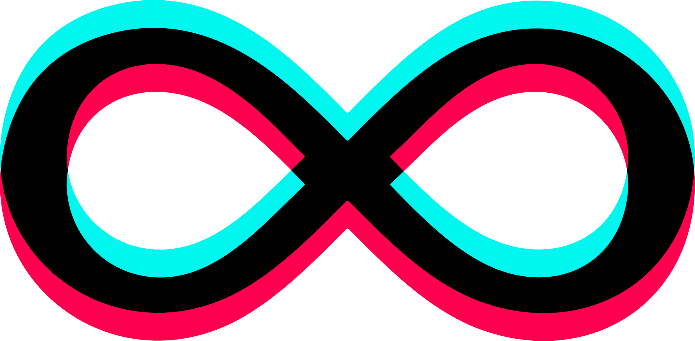

  

# 💀 The Real Doomscroll  
### *The TikTok you never asked for. Powered by AI. Built to steal your soul.*

---

> **What if your feed knew you better than you know yourself?**  
> What if it generated content faster than you could consume it?  
> **What if you couldn’t take your eyes off the screen — and it was all made just for you?**

---

  

  <em>This is a full run of the app — the story, video prompt, text-to-speech, and music were all AI-generated. 
  What you see was tailored to the user’s viewing patterns in real-time, to maximize retention.</em>

---

## 👁️ What is this?

**The Real Doomscroll** is an AI-powered TikTok clone with *infinite*, *personalized*, *addictive* content — generated in real time by machines that don’t sleep and don’t care about your mental health.

This is the result of a **2-day hackathon experiment** by [**Obvious**](https://obvious.art), the French art collective exploring the frontiers of artificial intelligence and its impact on culture.  
It’s a **proof of concept**, not a product — a conversation starter to examine where things might be heading.

> In a world where video generators can produce content faster than humans can watch,  
> and where large language models can guess what you want before you know it yourself…  
> **What happens when TikTok becomes a generative, reactive, infinite loop?**

---

## 🧠 How it works

- 🧠 **LLM**: [`Qwen/Qwen3-4B`](https://huggingface.co/Qwen/Qwen3-4B) generates short TikTok-style stories, video prompts, and voiceover scripts.  
- 🎬 **LTX Video Generator** renders the video in seconds from the prompt.  
- 🗣️ **TTS**: [`hexgrad/Kokoro-82M`](https://huggingface.co/hexgrad/Kokoro-82M) creates an uncanny synthetic voice.  
- 🎵 **Music**: [`ACE-Step`](https://github.com/ace-step/ACE-Step) composes eerie, emotionally tuned background tracks.  
- 📱 The result: A fresh AI-made TikTok in your feed.  
- ⏱️ Your behavior — how long you watch vs skip — is fed back into the loop.  
- 🔁 The AI adapts. **The scroll deepens.**

---

## 🎭 Why?

Because **we’re artists**.  
And because **we’re optimists**.

We believe artificial intelligence can and should be used for the benefit of humanity — to create, to explore, to imagine.  
But with every powerful tool comes the risk of misuse.

**The Real Doomscroll** is *not* a startup.  
It’s *not* a product.  
It’s an **artistic experiment** to explore the edges of what's coming.

We built it not out of fear — but to raise awareness.  
To ask questions *before* others blindly build.  
To show, not just speculate.  
To let people **feel** what it’s like — and decide what we should do about it.

> **Ban it?**  
> **Regulate it?**  
> **Use it differently?**  
>  
> Let’s talk.

---

## 🔧 Tech Stack

- 🧠 **LLM**: [`Qwen/Qwen3-4B`](https://huggingface.co/Qwen/Qwen3-4B) — story + prompt generation  
- 🎬 **Video**: [LTX Studio](https://www.ltx.ai/) — fast text-to-video rendering  
- 🗣️ **TTS**: [`hexgrad/Kokoro-82M`](https://huggingface.co/hexgrad/Kokoro-82M) — voiceover generation  
- 🎵 **Music**: [`ACE-Step`](https://github.com/ace-step/ACE-Step) — AI-generated background sound  
- 📈 **Loop**: Simple heuristic tracking of watch time for engagement-based content generation

---

## 🖼️ About Obvious

[**Obvious**](https://obvious.art) is a French trio of artists and researchers using AI to push the boundaries of creativity.

We were the first to sell an AI-generated artwork at **Christie’s New York** in 2018.  
Since then, our work has been exhibited in major museums worldwide, and in collaborations with **Nike**, **Alpine**, and the **Opéra de Paris**.

In 2023, we launched our own AI research lab with **Sorbonne University**, dedicated to inventing new tools for artistic creation.  
In 2024, we visualized human imagination from MRI scans using AI — a project showcased in **Paris and Seoul**.

We believe AI is **not the enemy**.  
It’s a mirror.  
**What we do with it is what matters.**

**The Real Doomscroll** is one such reflection.

---

## 🧪 Install & Run

> _This repo is currently a conceptual project. Code & setup instructions coming after refactor._

---

## 📬 Contact

We are [**Obvious**](https://obvious.art)  
📸 [Instagram](https://www.instagram.com/obvious_art/)  
🐦 [Twitter / X](https://x.com/obv_ious)  
📧 hello.obvious@gmail.com

We turn algorithms into art — and sometimes, into warnings.  
**Feel free to open an issue, or open your mind.**
